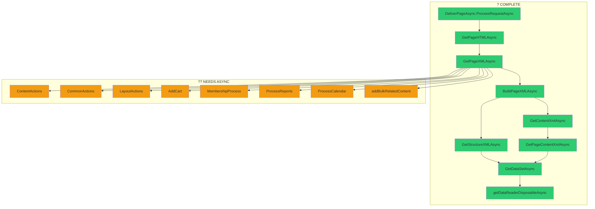

# Async Migration Plan for GetPageXML

## Overview
This plan outlines the systematic migration of `GetPageXML()` and all methods it calls to async methodology in the ProteanCMS codebase.

## Target Framework
- .NET Framework 4.8
- C# 7.3
- ASP.NET Web Forms

---

## ? CURRENT IMPLEMENTATION STATUS

### Execution Chain Already in Place

The async infrastructure is **substantially implemented**. The following components are already in place:

#### Entry Point Handler
- ? `DeliverPageAsync.cs` - HTTP async handler using `HttpTaskAsyncHandler`
- ? `ProcessRequestAsync()` - Async request processing with CancellationToken support
- ? `GetCancellationToken()` - Client disconnection token via reflection

#### Cms.Async.cs (Partial Class)
| Method | Status | Notes |
|--------|--------|-------|
| `GetPageHTMLAsync()` | ? Complete | Full async page rendering |
| `HandlePDFResponseAsync()` | ? Complete | PDF generation |
| `BuildPageXMLAsync()` | ? Complete | Async page XML building |
| `GetPageXMLAsync()` | ? Complete | Async page XML retrieval |
| `GetStructureXMLAsync()` (3 overloads) | ? Complete | Async menu structure |
| `GetContentXmlAsync()` | ? Complete | Async content retrieval |
| `GetPageContentXmlAsync()` | ? Complete | Async page content |
| `GetMenuContentFromSelectAsync()` | ? Complete | Async menu content |
| `AddContentBriefAsync()` | ? Complete | Async content briefs |
| `AddContentCountAsync()` | ? Complete | Async content counts |

#### Cms.DBHelper.Async.cs (Partial Class)
| Method | Status | Notes |
|--------|--------|-------|
| `getPageLayoutAsync()` | ? Complete | Async layout retrieval |

#### Database.Async.cs (Protean.Tools)
| Method | Status | Notes |
|--------|--------|-------|
| `GetDataSetAsync()` | ? Complete | Primary async data retrieval |
| `getDataReaderDisposableAsync()` | ? Complete | Async data reader with auto-disposal |
| `ExecuteReaderAsync()` | ? Complete | Callback-based reader |
| `ExecuteScalarAsync<T>()` | ? Complete | Async scalar queries |
| `ExeProcessSqlAsync()` | ? Complete | Async non-query execution |
| `addTableToDataSetAsync()` | ? Complete | Async table addition |

---

## ?? REMAINING WORK (Steps Still Required)

### Methods NOT Yet Migrated to Async in GetPageXMLAsync()

The following methods are called **synchronously** within `GetPageXMLAsync()` and need async versions:

| Method | Current Call | Async Version Needed |
|--------|--------------|---------------------|
| `MembershipProcess()` | Line 800 | `MembershipProcessAsync()` |
| `ContentActions()` | Lines 810, 830 | `ContentActionsAsync()` |
| `addBulkRelatedContent()` | Line 825 | `addBulkRelatedContentAsync()` |
| `CommonActions()` | Line 833 | `CommonActionsAsync()` |
| `LayoutActions()` | Line 834 | `LayoutActionsAsync()` |
| `AddCart()` | Line 835 | `AddCartAsync()` |
| `Quote.apply()` | Line 841 | `Quote.applyAsync()` |
| `ProcessReports()` | Lines 861, 870 | `ProcessReportsAsync()` |
| `ProcessCalendar()` | Line 873 | `ProcessCalendarAsync()` |
| `RefreshUserXML()` | Line 804 | `RefreshUserXMLAsync()` |

### Database Helper Methods Needing Async
| Method | Location | Priority |
|--------|----------|----------|
| `addBulkRelatedContent()` | Cms.DBHelper.cs | High |
| `logActivity()` | Cms.DBHelper.cs | Medium |
| Other `moDbHelper.*` calls | Various | As needed |

---

## Call Chain Visualization



---

## REVISED STEP PLAN

### ~~Step 1: Create Method Inventory~~ ? COMPLETE
The method inventory has been established. Key async methods exist in:
- `Assemblies\Protean.CMS\core\Cms.Async.cs`
- `Assemblies\Protean.CMS\core\Cms.DBHelper.Async.cs`
- `Assemblies\Protean.Tools\Database.Async.cs`

### ~~Step 2: Database Layer Async~~ ? MOSTLY COMPLETE
The following are implemented:
- `GetDataSetAsync()`
- `getDataReaderDisposableAsync()`
- `ExecuteReaderAsync()`
- `ExecuteScalarAsync<T>()`
- `ExeProcessSqlAsync()`
- `addTableToDataSetAsync()`
- `getPageLayoutAsync()`

**Remaining:** `addBulkRelatedContentAsync()` and other specific dbHelper methods

### ~~Step 3: Core CMS Async Methods~~ ? MOSTLY COMPLETE
- `GetPageHTMLAsync()` ?
- `GetPageXMLAsync()` ?
- `BuildPageXMLAsync()` ?
- `GetStructureXMLAsync()` ?
- `GetContentXmlAsync()` ?
- `GetPageContentXmlAsync()` ?
- `AddContentBriefAsync()` ?
- `AddContentCountAsync()` ?

### ~~Step 4: Entry Point~~ ? COMPLETE
`DeliverPageAsync.cs` is fully implemented with:
- `HttpTaskAsyncHandler` base class
- `ProcessRequestAsync()` method
- CancellationToken support
- Error handling and cleanup

---

## REMAINING STEPS TO COMPLETE

### Step 5: Convert Remaining Synchronous Methods in GetPageXMLAsync

**Priority: HIGH** - These methods are called synchronously within the async chain, blocking the thread.

#### 5.1 ContentActionsAsync()
**Location:** `Cms.cs:4362`
```
Current: ContentActions()
Target:  await ContentActionsAsync(cancellationToken).ConfigureAwait(false)
```
- Scans content nodes for action attributes
- Invokes dynamic module methods (may use reflection)
- Database interaction: Possible via modules

#### 5.2 CommonActionsAsync()  
**Location:** To be created
```
Current: CommonActions()
Target:  await CommonActionsAsync(cancellationToken).ConfigureAwait(false)
```

#### 5.3 LayoutActionsAsync()
**Location:** `Cms.cs:4724`
```
Current: LayoutActions()
Target:  await LayoutActionsAsync(cancellationToken).ConfigureAwait(false)
```
- Handles search, quotes, orders
- Database interaction: Via Cart, Quote, Search classes

#### 5.4 MembershipProcessAsync()
**Location:** `Cms.cs:5823`
```
Current: MembershipProcess()
Target:  await MembershipProcessAsync(cancellationToken).ConfigureAwait(false)
```
- Delegates to `moMemProv.Activities.MembershipProcess()`
- Database interaction: Yes, via membership provider

#### 5.5 AddCartAsync()
**Location:** `Cms.cs:3921`
```
Current: AddCart()
Target:  await AddCartAsync(cancellationToken).ConfigureAwait(false)
```
- Initializes and applies cart
- Database interaction: Yes, via Cart class

#### 5.6 ProcessReportsAsync()
**Location:** `Cms.cs:3957`
```
Current: ProcessReports()
Target:  await ProcessReportsAsync(cancellationToken).ConfigureAwait(false)
```
- Applies report processing
- Database interaction: Yes, via Report class

#### 5.7 ProcessCalendarAsync()
**Location:** `Cms.cs:3983`
```
Current: ProcessCalendar()
Target:  await ProcessCalendarAsync(cancellationToken).ConfigureAwait(false)
```
- Applies calendar processing
- Database interaction: Possible

#### 5.8 addBulkRelatedContentAsync()
**Location:** `Cms.DBHelper.cs`
```
Current: moDbHelper.addBulkRelatedContent()
Target:  await moDbHelper.addBulkRelatedContentAsync(cancellationToken).ConfigureAwait(false)
```
- Heavy database operation for related content
- Database interaction: Yes, multiple queries

### Step 6: Update GetPageXMLAsync to Use New Async Methods

After creating the async versions in Step 5, update `Cms.Async.cs` lines 800-877:

```csharp
// Current synchronous calls in GetPageXMLAsync:
MembershipProcess();           // Line 800
ContentActions();              // Lines 810, 830  
moDbHelper.addBulkRelatedContent(); // Line 825
CommonActions();               // Line 833
LayoutActions();               // Line 834
AddCart();                     // Line 835
ProcessReports();              // Lines 861, 870
ProcessCalendar();             // Line 873

// Should become:
await MembershipProcessAsync(cancellationToken).ConfigureAwait(false);
await ContentActionsAsync(cancellationToken).ConfigureAwait(false);
await moDbHelper.addBulkRelatedContentAsync(..., cancellationToken).ConfigureAwait(false);
await CommonActionsAsync(cancellationToken).ConfigureAwait(false);
await LayoutActionsAsync(cancellationToken).ConfigureAwait(false);
await AddCartAsync(cancellationToken).ConfigureAwait(false);
await ProcessReportsAsync(cancellationToken).ConfigureAwait(false);
await ProcessCalendarAsync(cancellationToken).ConfigureAwait(false);
```

### Step 7: Add Comprehensive Tests
- Create `CmsAsyncTests.cs` in `ProteanCMS.UnitTests`
- Test each async method independently
- Verify XML output matches sync versions
- Test cancellation token behavior

### Step 8: Documentation & Cleanup
- Add XML documentation to all new async methods
- Update `README.AsyncMigration.md`
- Add `[Obsolete]` attributes to sync wrappers where appropriate

---

## Key Methods to Convert (Summary Table)

| Method | File | Return Type | Async Return Type | DB Interaction |
|--------|------|-------------|-------------------|----------------|
| `GetPageXML()` | Cms.cs:2361 | `XmlDocument` | `Task<XmlDocument>` | Indirect |
| `BuildPageXML()` | Cms.cs:2590 | `XmlDocument` | `Task<XmlDocument>` | Yes |
| `GetStructureXML()` | Cms.cs:6680+ | `XmlElement` | `Task<XmlElement>` | Yes |
| `GetContentXml()` | Cms.cs:8268 | `void` | `Task` | Yes |
| `ContentActions()` | Cms.cs:4362 | `void` | `Task` | Yes |
| `LayoutActions()` | Cms.cs:4724 | `string` | `Task<string>` | Indirect |
| `CommonActions()` | Cms.cs | `void` | `Task` | Possible |
| `MembershipProcess()` | Cms.cs:5823 | `string` | `Task<string>` | Yes |
| `AddCart()` | Cms.cs:3921 | `void` | `Task` | Yes |
| `ProcessReports()` | Cms.cs:3957 | `void` | `Task` | Possible |
| `ProcessCalendar()` | Cms.cs:3983 | `void` | `Task` | Possible |
| `dbHelper.GetDataSet()` | Cms.DBHelper.cs | `DataSet` | `Task<DataSet>` | Yes |
| `dbHelper.addBulkRelatedContent()` | Cms.DBHelper.cs | `void` | `Task` | Yes |

---

## Dependencies and Considerations

### .NET Framework 4.8 Constraints
- `SqlDataAdapter.FillAsync()` is not available - must use `SqlDataReader.ReadAsync()` and manually populate DataSet/DataTable
- Use `ConfigureAwait(false)` to avoid deadlocks in ASP.NET context
- C# 7.3 - no `await using`, use `try/finally` for disposal

### ASP.NET Web Forms Considerations
- Add `<%@ Page Async="true" %>` directive to pages using async methods
- Use `RegisterAsyncTask()` for complex async operations
- Be cautious with `async void` - only for event handlers

### Backward Compatibility
- Keep synchronous method signatures
- Use `.GetAwaiter().GetResult()` pattern in sync wrappers
- Add `[Obsolete]` attributes to guide developers to async versions
